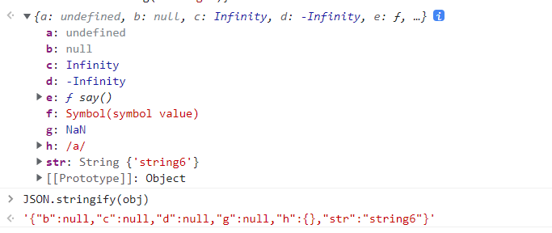

# 前端编程题

## debounce 防抖

防抖原理：连续触发事件，只有最后一次事件被触发 n 秒之后才会执行回调，是解决事件回调频繁调用的手段之一。

实现思路：

- 事件触发，设置定时器，在 n 秒之后调用回调
- 若 n 秒之内再次触发事件，则清空定时器并重新设置

注意事项：`this` 指向的修正、参数的正确传递。

```js
function debounce(func, wait) {
  let timeout = null;

  return function() {
    const context = this;
    const args = arguments;

    if (timeout) {
      clearTimeout(timeout);
      timeout = null;
    }

    timeout = setTimeout(function() {
      func.apply(context, args);
    }, wait)
  }
}
```

## throttle 节流

节流原理：连续触发事件，每隔 n 秒执行一次回调，解决事件回调频繁调用的手段之一。

实现思路：主要有两种，使用时间戳判断和定时器。

### 时间戳

主要流程：
- 一个变量 `now` 记录当前事件触发的时间戳，一个变量 `previous` 记录上一次触发的时间戳
- 事件触发，判断 `now` 与 `previous` 的差值是否大于时间间隔 `wait`。若大于则调用回调函数，并将 `previous` 更新为 `now` 的值
- 若 n 秒内再次触发事件，由于存在时间差节流阀，不会再次调用回调函数

```js
function throttle(func, wait) {
  let previous = 0;

  return function () {
    const context = this;
    const args = arguments;
    const now = +new Date();

    if (now - previous >= wait) {
      func.apply(context, args);
      previous = now;
    }
  };
}
```

### 定时器

主要流程：
- 事件触发，设置定时器，在 n 秒之后执行回调函数并清空定时器
- 若 n 秒内再次触发事件，不会做任何动作

```js
function throttle(func, wait) {
  let timer = null;

  return function () {
    const context = this;
    const args = arguments;
    if (!timer) {
      timer = setTimeout(() => {
        func.apply(context, args);
        clearTimeout(timer);
        timer = null;
      }, wait);
    }
  };
}
```

### 结合体

时间戳和定时器方式各有独特的效果：时间戳会在事件触发的时候立即执行一次回调函数，定时器方式会在停止触发事件之后再执行一次回调函数。

这就是 `lodash` 和 `underscore` 工具库 `throttle` 方法的 `leading` 和 `trailing` 配置参数。

[Lodash throttle](https://www.lodashjs.com/docs/lodash.throttle#_throttlefunc-wait0-options){link=card}

```js
function throttle(func, wait, option) {
  if (typeof option !== 'object') {
    option = {};
  }
  let previous = 0;
  let timer = null;
  const { leading, trailing } = option;

  const throttled = function () {
    const context = this;
    const args = arguments;
    const now = +new Date();
    if (previous === 0 && leading === false) {
      previous = now;
    }
    const remaining = wait - (now - previous);

    if (remaining <= 0) {
      // 若时间戳先执行了，清空定时器
      if (timer) {
        clearTimeout(timer);
        timer = null;
      }
      func.apply(context, args);
      previous = now;
      return;
    }
    if (!timer && trailing === true) {
      timer = setTimeout(() => {
        // 若定时器先执行了，更新previous时间
        previous = +new Date();
        func.apply(context, args);
        clearTimeout(timer);
        timer = null;
      }, remaining);
    }
  };

  return throttled;
}
```

注意，若时间戳先执行了，则要清空定时器，若定时器先执行了，则要更新previous时间。否则如果不断触发事件，会出现执行两次回调的情况。

## unique 去重

数组去重，经典中的经典。

### 双重循环

双重循环，最原始同时也是兼容性最好的版本。

```js
function unique1(arr) {
  const res = [];
  for(let i = 0;i < arr.length;i++) {
    // 注意这里用 var，否则下面的判断无法取到 j
    // 当然也可以在外层定义好
    for(var j = 0;j < res.length;j++) {
      if(arr[i] === res[j]) {
        break;
      }
    }
    if(j === res.length) {
      res.push(arr[i]);
    }
  }
  return res;
}
```

使用数组的 `indexOf` 方法，可以简化代码。

```js
function unique2(arr) {
  const res = [];
  for(let i = 0;i < arr.length;i++) {
    if(res.indexOf(arr[i]) === -1) {
      res.push(arr[i]);
    }
  }
  return res;
}
```

### `underscore` 版本

`underscore` 的去重方法主要有两个额外参数：`isSorted` 和 `iteratee`。

`isSorted` 参数标识待去重的数组是否已经排好序，如果是排序好的数组使用更快捷的方法（判断当前元素是否与前一个元素相同，相同即重复，只需一次遍历）进行去重。

`iteratee` 传递一个自定义函数，对于数组每一个元素，是对该函数处理后的返回值进行比较，达到自定义去重规则的效果。

```js
function unique3(arr, isSorted, iteratee) {
  const res = [];
  // 存储自定义函数处理后的值
  const dealValueArr = [];
  // 排序情况下的前一个值
  const previousValue = undefined;

  for(let i = 0;i < arr.length;i++) {
    const value = arr[i];
    const dealValue = iteratee ? iteratee(value) : value;

    if(isSorted) {
      // 若是第一个元素或者和前一个元素不相同
      if(i === 0 || value !== previousValue) {
        res.push(value);
      }
      previousValue = value;
    } else if(iteratee) {
      if(dealValueArr.indexOf(dealValue) === -1) {
        // 注意res压入的是原始数组的值，不是经自定义函数处理后的返回值
        res.push(value);
        dealValueArr.push(dealValue);
      }
    } else {
      if(res.indexOf(value) === -1) {
        res.push(value);
      }
    }
  }
  return res;
}
```

### Object 键值对

该方法的主要思路是：把数组元素作为 key 值存入一个对象里面，在判断一个元素是否重复时，只需要看对象是否存在这个元素的 key 值。

`typeof item + JSON.stringify(item)` 的处理是为了保证 key 值唯一。

```js
function unique4(arr) {
  const obj = {};
  return arr.filter(function(item, index, array) {
    const keyValue = typeof item + JSON.stringify(item);
    return obj.hasOwnProperty(keyValue) ? false : (obj[keyValue] = true)
  })
}
```

### 不能 JSON 序列化的特殊值

json 是独立于编程语言的数据存储和表示格式，也就是说它只能存储各个语言通用的东西，JavaScript 特有的一些值无法正确 JSON 序列化。



:::tip
如图，`undefined`、JS 方法、`Symbol` 类型值经过 `stringify()` 处理后都丢失了。

`Infinity`、`NaN` 和数字相关的特殊值转换成了 `null`。

正则表达式转换成了空对象 `{}`。
:::

### 利用 ES6 新特性

扩展运算符天下无双。

```js
function unique5(arr) {
  return [...new Set(arr)];
}
```


## shallowClone 浅拷贝

```js
function shallowClone(obj) {
  // 不是对象直接返回
  if(obj === null || typeof obj !== 'object' || || obj instanceof RegExp) {
    return obj;
  }

  // 对象循环拷贝
  const res = obj instanceof Array ? [] : {};
  for(let key in obj) {
    if(obj.hasOwnProperty(key)) {
      res[key] = obj[key];
    }
  }
  return res;
}
```

由于 `typeof null` 的结果是 `object`，因此需要单独判断 `null` 值，否则拷贝 `null` 值会得到空对象 `{}`，比较怪异。

JS 发展到今天，除了手撸一个浅拷贝函数之外，还能使用 `Object.assign()`、`...扩展运算符` 浅拷贝对象和数组，`concat()`、`slice()` 浅拷贝数组。

## deepClone 深拷贝

深拷贝就是在浅拷贝的基础上判断遍历拷贝的值是否为对象，如果是对象，则递归调用深拷贝函数。

### 手撸深拷贝
```js
function deepClone(obj) {
  if(obj === null || typeof obj !== 'object' || || obj instanceof RegExp) {
    return obj;
  }

  const res = obj instanceof Array ? [] : {};
  for(let key in obj) {
    if(obj.hasOwnProperty(key)) {
      res[key] = typeof obj[key] === 'object' ? deepClone(obj[key]) : obj[key];
    }
  }
  return res;
}
```

上述方式是比较基础的深拷贝实现方式，能实现日常开发常见对象的拷贝，没有考虑 DOM 对象、时间对象等特殊情况。不过也能应对日常开发的需求了，如果需要拷贝特殊对象再进行额外的考虑即可。

### `JSON`

使用 `JSON.stringify()` 和 `JSON.parse()` 方法实现深拷贝。

这种方法简单方便，但无法正确拷贝 JS 特有的数据类型，如 `undefined`、JS 方法、`Symbol`、`Infinity`、`NaN`。

### `lodash`

使用 `lodash` 的 `cloneDeep()` 方法。

日常开发最佳解决方案，使用成熟的解决方案。缺点是需要额外引入第三方库。

### `MessageChannel`

一种比较少见的方式，利用 `MessageChannel` 消息通道接口。

```js
function deepClone(obj) {
  return new Promise((resolve) => {
    const { port1, port2 } = new MessageChannel();
    // port1 端口监听消息
    port2.onmessage = event => resolve(event.data);
    // port2 发送消息，会自动把 obj 进行深拷贝，port1 收到的就是拷贝好的对象
    port1.postMessage(obj);
  });
}

const obj = {};
const res = await deepClone(obj);
```

该方法好处是可以拷贝 `undefined` 和循环引用对象，但是不能拷贝 `Symbol类型数据`、方法对象，并且是异步的，使用起来要多写点代码。

:::details 结构化克隆算法
`postMessage` 发送的数据 `message` 将会被结构化克隆算法 (en-US) 序列化。这意味着你可以不受什么限制的将数据对象安全的传送给目标窗口而无需自己序列化。

结构化克隆算法用于复制复杂 JavaScript 对象的算法。通过来自 `Worker` 的 `postMessage()` 或使用 `IndexedDB` 存储对象时在内部使用。它通过递归输入对象来构建克隆，同时保持先前访问过的引用的映射，以**避免无限遍历循环**。
:::

:::details 结构化克隆不能做到的
- `Function` 对象是不能被结构化克隆算法复制的；如果你尝试这样子去做，这会导致抛出 `DATA_CLONE_ERR` 的异常。
- 企图去克隆 DOM 节点同样会抛出 `DATA_CLONE_ERR` 异常。
- 对象的某些特定参数也不会被保留
  - `RegExp` 对象的 `lastIndex` 字段不会被保留
  - 属性描述符，`setters` 以及 `getters`（以及其他类似元数据的功能）同样不会被复制。例如，如果一个对象用属性描述符标记为 `read-only`，它将会被复制为 `read-write`，因为这是默认的情况下。
  - 原形链上的属性也不会被追踪以及复制。
:::

相关链接：

[MDN MessageChannel](https://developer.mozilla.org/zh-CN/docs/Web/API/MessageChannel){link=card}

[MDN postMessage](https://developer.mozilla.org/zh-CN/docs/Web/API/Window/postMessage){link=card}

[MDN 结构化克隆算法](https://developer.mozilla.org/zh-CN/docs/Web/API/Web_Workers_API/Structured_clone_algorithm){link=card}