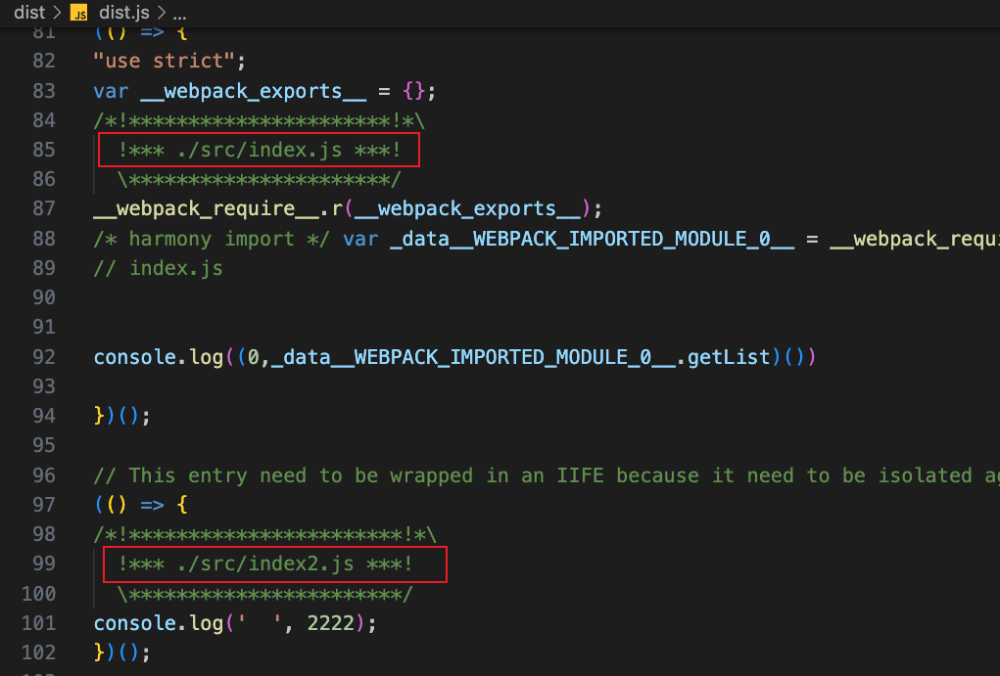
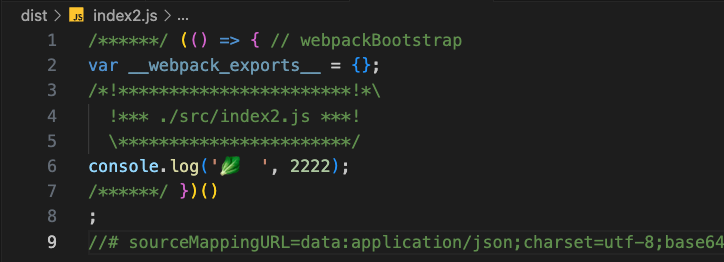
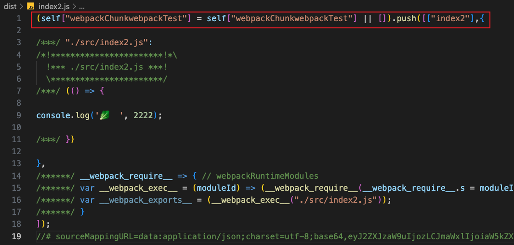

# webpack 概念

## webpack 是什么

webpack 是一个强大的模块打包工具，用于处理和打包 JavaScript 应用程序的依赖关系。它能够把许多分散的模块按照依赖关系打包成一个或多个捆绑包（bundle），这些 bundle 可以直接在浏览器中运行。

:::tip [webpack](https://www.webpackjs.com/concepts/)
本质上，webpack 是一个用于现代 JavaScript 应用程序的静态模块打包工具。当 webpack 处理应用程序时，它会在内部从一个或多个入口点构建一个依赖图，然后将项目中所需的每个模块组合成一个或多个 bundles。它们都是静态资源，用于展示你的内容。
:::

从而减少页面的请求次数和加载时间，提高网页的性能和用户体验。

它的主要功能如下：

1. 模块化管理。webpack 支持多种模块化方案，包括 CommonJS、AMD、ES6 模块等。可以将多个模块打包成一个或多个文件，使代码更加清晰、易于维护和重用。

2. 自动化构建。webpack 提供了丰富的插件和工具，可以自动化完成**编译、打包、压缩、混淆**等一系列操作，大大提高了前端开发的效率和质量。

3. 资源优化。webpack 可以对不同类型的资源进行优化，如脚本、样式、图片、字体等，可以**自动压缩、合并、缓存**等，从而减少页面的请求次数和加载时间，提高网页的性能和用户体验。

4. 插件机制。webpack 提供了强大的插件机制，可以通过插件扩展，定制自己的构建流程和功能，满足不同项目的需求。

5. 社区支持。webpack 有庞大的社区支持，提供了丰富的文档、教程和示例，可帮助开发者快速入门和解决问题。

## 五大核心概念

- entry(入口)：指示 webpack 从哪个文件开始打包。

- output(输出)：指示 webpack 打包后的文件输出到哪里，如何命名。

- loader(loader)：webpack 本身只能处理 js、JSON 文件，其它资源需要借助 loader，webpack 才能解析。

- plugins(插件)：扩展 webpack 的功能。

- mode(模式)：指示 webpack 使用哪种构建模式。

## 入口(entry)

### 单入口

用法：`entry: string | [string]`。

```js
// 简写形式
module.exports = {
  entry: './src/index.js',
}

// 完整形式
module.exports = {
  entry: {
    main: './src/index.js',
  },
}
```

可将一个文件路径的数组作为 entry 的属性值，此时创建了 `multi-main entry`。

这样可以一次性注入多个依赖文件，并将他们的依赖关系绘制在一个 chunk 中。

```js
// 简写形式
module.exports = {
  entry: ['./src/index.js', './src/index2.js'],
}

// 完整形式
module.exports = {
  entry: {
    main: ['./src/index.js', './src/index2.js'],
  },
}
```

可以看到，这两个文件被打包在同一个 chunk 中。



### 对象语法

#### 基本使用

用法：`entry: { <entryChunkName> string | [string] } | {}`。

对象语法指定**将哪些文件打包在同一个 chunk 中**，生成多个 chunk。

注意，使用多个入口的对象语法，必须对应地使用输出(output)多个出口的写法。

否则报错，`Error: Conflict: Multiple chunks emit assets to the same filename dist.js (chunks index and index2)`。

```js
module.exports = {
  entry: {
    index: './src/index.js',
    index23: ['./src/index2.js', './src/index3.js'],
  },
  output: {
    filename: '[name].js', // 指定打包后的文件名
    path: path.resolve(__dirname, 'dist'),
  },
}
```

打包后，生成了2个chunk。


:::danger TIP
“webpack 配置的可扩展” 是指，这些配置可以重复使用，并且可以与其他配置组合使用。这是一种流行的技术，用于将关注点从环境(environment)、构建目标(build target)、运行时(runtime)中分离。然后使用专门的工具（如 webpack-merge）将它们合并起来。

当你通过插件生成入口时，你可以传递空对象 {} 给 entry。
:::

### 描述入口的对象

入口的对象语法有如下的属性。

- `dependOn`：当前入口所依赖的入口。它们必须在该入口加载前被加载。
- `filename`：指定要输出的文件名称。
- `import`：启动时需加载的模块。
- `library`：指定 library 选项，为当前 entry 构建一个 library。
- `runtime`：运行时 chunk 的名字。如果设置了，会创建一个新的运行时 chunk。在 webpack 5.43.0 后可将其设为 false，以避免一个新的运行时 chunk。
- `publicPath`：当该入口的输出文件在浏览器被引用时，为它们指定一个公共 URL 地址。详见 [ouput.publicPath](https://www.webpackjs.com/configuration/output/#outputpublicpath)。

```js
module.exports = {
  entry: {
    index: './src/index.js',
    index2: {
      // dependOn: 'index',
      import: './src/index2.js',
    },
  },
}
```

上述配置，设置了 `dependOn` 前后的区别如下。






:::danger 注意事项
1. `runtime` 和 `dependOn` 不能在同一个入口上同时使用，否则配置无效，且会抛出错误。

```js
module.exports = {
  entry: {
    index: './src/index.js',
    index2: {
      runtime: 'run2',
      dependOn: 'index',
      import: './src/index2.js',
    },
  },
}
```


2. `runtime` 不能指向已经存在的入口名称，否则会报错。

```js
module.exports = {
  entry: {
    index: './src/index.js',
    index2: {
      runtime: 'index',
      import: './src/index2.js',
    },
  },
}
```


3. `dependOn` 不能循环引用，否则会报错。

```js
module.exports = {
  entry: {
    index: './src/index.js',
    index2: {
      runtime: 'index',
      import: './src/index2.js',
    },
  },
}
```


:::

## 入口常见场景

### 分离APP和vendor(第三方库)入口

```js
module.exports = {
  entry: {
    app: './src/app.js',
    vendor: './src/vendor.js'
  },
}
```

配置了 2 个单独的入口点。

这样就可在 `vendor.js` 中存入未做修改的必要 library 或文件（如 Bootstrap、jQuery、图片等），将它们打包在一起生成单独的 chunk。

:::warning 注意事项
在 webpack < 4 的版本中，通常将 vendor 作为一个单独的入口起点添加到 entry 选项中，以将其编译为一个单独的文件（与 `CommonsChunkPlugin` 结合使用）。

而在 webpack 4 中不鼓励这样做。而是使用 `optimization.splitChunks` 选项，将 vendor 和 app(应用程序) 模块分开，并为其创建一个单独的文件。不要为 vendor 或其他不是执行起点创建 entry。
:::

### 多页面应用程序

```js
module.exports = {
  entry: {
    pageOne: './src/pageOne/index.js',
    pageTwo: './src/pageTwo/index.js',
    pageThree: './src/pageThree/index.js',
  },
};
```

告诉 webpack 需要三个独立分离的依赖图。

在多页面应用程序中，server 会拉取一个新的 HTML 文档给你的客户端。页面重新加载此新文档，并且资源被重新下载。然而，这给了我们特殊的机会去做很多事，例如使用 `optimization.splitChunks` 为页面间共享的应用程序代码创建 bundle。由于入口起点数量的增多，多页应用能够复用多个入口起点之间的大量代码/模块，从而可以极大地从这些技术中受益。

[webpack多页面打包实践](https://zhuanlan.zhihu.com/p/109527475){link=card}

[webpack 拆包：关于 splitChunks 的几个重点属性解析](https://segmentfault.com/a/1190000042093955){link=card}

## 出口(output)

`output` 属性用于配置 webpack 打包生成的文件输出到哪里，以及如何命名这个文件。

输出文件路径和文件名默认值是 ``./dist/main.js`。

```js
const path = require('path');
module.exports = {
  output: {
    filename: 'bundle.js', // 指定打包后的文件名
    path: path.resolve(__dirname, 'dist'), // 指定打包文件生成的目录
  },
}
```

如果 entry 配置了多个入口起点，则需使用占位符确保每个输出文件具有唯一的名称。否则会报错。

`[name]` 是指入口文件的文件名，`[contenthash]` 是指根据文件内容生成的 hash 值，`[contenthash:8]` 表示只取前 8 位。

```js
const path = require('path');
module.exports = {
  output: {
    filename: '[name].[contenthash:8].js', // 指定打包后的文件名
    path: path.resolve(__dirname, 'dist'), // 指定打包文件生成的目录
  },
}
```

## loader

loader 好文。

[看完这篇webpack-loader，不再怕面试官问了](https://juejin.cn/post/6844904054393405453){link=card}

[Loader原理](https://learn.fuming.site/front-end/Webpack/origin/loader.html){link=card}

### 概述

webpack 只能处理打包 JavaScript 和 JSON 文件，这是 webpack 开箱可用的自带能力。

loader 让 webpack 能够处理其他类型的文件，并将它们转换为有效模块，以供应用程序使用，以及被添加到依赖图中。

一个 loader 的职责是单一的，只需要完成一种转换。若一个源文件需要经历多步转换才能正常使用，就要通过多个 loader 去转换。在调用多个 loader 处理一个文件时，每个 loader 会链式执行，第一个 loader 会拿到需要处理的原内容。上一个 loader 处理后的结果会传递给下一个 loader，最后一个 loader 将处理完成的最终结果返回给 webpack。

因此，在开发一个 loader 的时候，请保持其职责的单一性，只需要关注输入和输出。

### 基本使用

loader 有两个属性。

- `test`：用于匹配要处理的文件。

- `use`：用于指定在进行转换时，要使用的 loader。

```js
module.exports = {
  module: {
    rules: [
      { test: /\.txt$/, use: 'raw-loader' },
    ]
  }
}
```

上述配置，对一个单独的 module 对象定义了 rules 属性。这告诉 webpack 编译器(compiler) 如下信息：

> ”嘿，webpack 编译器，当你碰到 「在 `require()/import` 语句中被解析为 `.txt` 的路径」时，在你对它打包之前，先 use(使用) `raw-loader` 转换一下。“

`/\.txt$/` 与 `'/\.txt$/'`、`"/\.txt$/"` 不一样。前者表示 webpack 匹配任何以 .txt 结尾的文件，后者表示 webpack 匹配具有绝对路径 '.txt' 的单个文件。

如果不用正则表达式，使用字符串的形式匹配，必须填入正确的绝对路径，让 webpack 可以正确匹配到对应的文件。

```js
module.exports = {
  module: {
    rules: [
      { test: '/Users/xxx/Documents/webpackTest/src/index.css', use: 'css-loader' },
    ]
  }
}
```

`'./index.css'` 会如下报错。


### 多个loader转换

如果配置了多个 loader，loader 的执行顺序是从右到左，从下到上。

```js
module.exports = {
  module: {
    rules: [
      // 从右到左
      { test: /\.css$/, use: ['style-loader', 'css-loader'] },
      // 从下到上，其实也是从右到左，use属性都是数组
      {
        test: /\.css$/,
        use: [
          { loader: 'style-loader' },
          {
            loader: 'css-loader',
            options: {
              modules: true,
            },
          },
          { loader: 'sass-loader' },
        ],
      },
    ]
  }
}
```

## 手撸 loader

### 基础结构

webpack 是运行在 Node.js 之上的，一个 loader 就是一个 Node.js 模块，这个模块需要导出一个函数。

这个函数的职责就是获取处理前的原内容，对原内容执行转换逻辑后，返回处理后的内容。

```js
module.exports = function(source) {
  // source 为 compiler 传递给 Loader 的⼀个⽂件的原内容
  // 该函数需要返回处理后的内容
  // 这⾥简单起⻅，直接把原内容返回，相当于该 loader 没有做任何转换
  return source;
}
```

由于 loader 运行在 Node.js 中，因此可以调用任何 Node.js 自带的 API，或安装第三方模块进行调用。

### 获得 loader 的 options

```js
const loaderUtils = require('loader-utils');

module.exports = function(source) {
  // 获取到⽤户给当前 Loader 传⼊的 options
  const options = loaderUtils.getOptions(this);
  return source;
}
```

`loader-utils` 是一个 npm 包，帮助开发者处理webpack loader 中的配置选项。

1. 获取配置选项：通过 `loader-utils` 提供的 `getOptions` 函数，可以方便地获取到webpack配置文件中为loader指定的选项（options）。这样做的好处是，开发者无需直接操作复杂的 `this.query` 对象，从而简化了代码并提高了可读性。

2. 验证配置选项：`loader-utils` 通常与 `schema-utils` 一起使用，以便对loader的配置选项进行验证。这有助于确保传递给loader的参数符合预期的数据类型和结构，从而避免在loader执行过程中因参数错误而导致的错误。

3. 简化开发流程：通过使用 `loader-utils`，开发者可以更加专注于loader的核心逻辑，而无需花费大量时间在处理配置选项等琐碎事务上。这有助于提高开发效率，并降低出错的可能性。

### 返回其它结果

```js
const loaderUtils = require('loader-utils');

module.exports = function(source) {
  // 通过this.callback告诉webpack返回的结果。该函数可同步或异步调用，并可返回多个结果。
  this.callback(null, source, sourceMap);
  // 当使用this.callback时，loader必须返回undefined。
  // 让webpack知道，loader返回的结果在this.callback中，而不是return中。
  return;
}
```

### 同步 loaders

无论是 return 还是 this.callback，都可以同步返回转换后的 content 值。

```js
// sync-loader.js
module.exports = function (content, map, meta) {
  return someSyncOperation(content);
};
```

this.callback 方法更灵活，它允许传递多个参数，而不仅仅是 content。

```js
// sync-loader-with-multiple-results.js
module.exports = function (content, map, meta) {
  this.callback(null, someSyncOperation(content), map, meta);
  return; // 当调用 callback() 函数时，总是返回 undefined。
}
```

### 异步 loaders

对于异步 loader，使用 this.async 来获取 callback 函数。

```js
// async-loader.js
module.exports = function (content, map, meta) {
  var callback = this.async();
  someAsyncOperation(content, function (err, result) {
    if (err) return callback(err);
    callback(null, result, map, meta);
  });
};
```

```js
// async-loader-with-multiple-results.js
module.exports = function (content, map, meta) {
  var callback = this.async();
  someAsyncOperation(content, function (err, result, sourceMaps, meta) {
    if (err) return callback(err);
    callback(null, result, sourceMaps, meta);
  });
};
```

:::tip 同步异步
loader 最初被设计为可以在同步 loader pipelines（如 Node.js，使用 enhanced-require），以及在异步 pipelines（如 webpack） 中运行。

然而，由于同步计算过于耗时，在 Node.js 这样的单线程环境下进行此操作不是好的方案，建议尽可能地使 loader 异步化。

但如果计算量很小，同步 loader 也是可以的。
:::

### 处理二进制数据(Raw loader)

默认情况下，资源文件会被转化为 UTF-8 字符串，然后传给 loader。通过设置 `raw` 为 `true`，loader 可以接收原始的 `Buffer`。每一个 loader 都可以用 `String` 或者 `Buffer` 的形式传递它的处理结果。complier 将会把它们在 loader 之间相互转换。

```js
// raw-loader.js
module.exports = function (content) {
  assert(content instanceof Buffer);
  return someSyncOperation(content);
  // 返回值也可以是一个 `Buffer`
  // 即使不是 "raw"，loader 也没问题
};
module.exports.raw = true;
```

### Pitching Loader

loader 总是从右到左被调用。有些情况下，loader 只关心 request 后面的元数据（metadata），并且忽略前一个 loader 的结果。在实际（从右到左）执行 loader 之前，会先**从左到右**调用 loader 上的 pitch 方法。

pitch 方法的三个参数：

- remainingRequest：后面的 loader+资源路径，loadername!的语法。

- precedingRequest：资源路径。

- metadata：和普通的 loader 函数的第三个参数一样，辅助对象，而且 loader 执行的全程用的是同一个对象。

实现 bundle.loader 异步加载。命中 pitch 后，后⾯的 loader 在动态引⼊⽂件时，可以以 loadername 的形式处理⽬标⽂件。

### context

`this.loadModule`：当 loader 在处理一个文件时，如果依赖其它文件的处理结果才能得出当前文件的结果时，可以通过 `this.loadModule(request: string, callback: function(err, source, sourceMap, module))` 去获得 request 对应文件的处理结果。

### 相关文章

[webpack实战，手写loader和plugin](https://segmentfault.com/a/1190000042779769){link=card}

[中文文档：Loader Interface](https://webpack.docschina.org/api/loaders/#asynchronous-loaders){link=card}

[深入浅出Webpack书籍：5-3编写loader章节](https://webpack.wuhaolin.cn/5%E5%8E%9F%E7%90%86/5-3%E7%BC%96%E5%86%99Loader.html){link=card}

## 插件(plugin)

loader 用于转换某些类型的模块，而插件可以用于执行范围更广的任务。包括：打包优化、资源管理、注入环境变量。

```js
const HtmlWebpackPlugin = require('html-webpack-plugin');
const webpack = require('webpack'); // 访问内置的插件

module.exports = {
  plugins: [
    new webpack.ProgressPlugin(),
    new HtmlWebpackPlugin({ template: './src/index.html' }),
  ],
}
```

### 组成

- 一个 ES6 class 类；
- 在类中定义一个 apply 方法；
- 指定一个绑定到 webpack 自身的事件钩子；
- 处理 webpack 内部实例的特定数据；
- 功能完成后调用 webpack 提供的回调；

### compiler 和 compilation

在开发 plugins 时最常用的就是 compiler 和 compilation 对象。它们是 plugins 和 webpack 之间的桥梁。

#### compiler

compiler 对象包含了 webpack 环境所有的配置信息，包括 options、loaders、plugins 这些信息。

这个对象在 webpack 启动时就被实例化，它是全局唯一的，可以简单理解为 webpack 实例。

#### compilation

compilation 对象代表了一次资源版本的构建。它包含了当前的模块资源、编译生成资源、变化的文件，以及被跟踪依赖的状态信息等。

当 webpack 以开发模式运行时，每当检测到一个变化，一次新的 compilation 将被创建。

compilation 对象也提供了很多事件回调供插件做扩展，通过 compilation 也可以读到 compiler 对象。

### Tapable

tapable 是 webpack 一个核心工具，它暴露了 tap、tapAsync、tapPromise 等方法，可以使用这些方法来触发 compiler 钩子，使插件可以监听 webpack 在运行过程中广播的事件，接着通过 compiler 对象去操作 webpack。

也可以使用这些方法注入自定义的构建步骤，这个步骤将在整个编译过程中的不同时机触发。

- tap：以同步方式触发 compiler 钩子。

- tapAsync：以异步方式触发 compiler 钩子。

- tapPromise：以异步方式触发 compiler 钩子，返回 Promise。

[开发一个 Webpack 插件原来这么简单](https://juejin.cn/post/6893097741258326030){link=card}

## loader 和 plugin 的区别

loader 用于对源代码文件进行转换和处理，而 plugin 用于对 webpack 的编译过程进行扩展和增强。

plugin 可以用于执行任意类型的任务，如生成 HTML 文件、压缩代码、提取公共代码等。

使用 plugin 可以实现 webpack 无法处理的复杂任务。

[webpack 中 loader 和 plugin 有啥区别?](https://zhuanlan.zhihu.com/p/618991058){link=card}

## 模式(mode)

mode 模式有三个取值：development，production，none。每个取值代表不同的构建环境和优化策略。

### none

在 none 模式下，webpack 不会应用任何默认的优化配置。开发者需要手动配置所有需要的优化和插件，以获得所需的构建效果。

使用场景：通常不推荐在常规项目中使用 none 模式，因为它不提供任何内置的优化，除非你有特殊需求或正在进行高度定制化的构建过程。

### development

development 模式用于开发环境，它提供了一些有助于开发的默认配置。例如，启用 source map 以支持源代码映射，提高调试效率；启用 NamedChunksPlugin 和 NamedModulesPlugin，为打包后的模块和 chunks 提供可读的名称，便于开发者识别。

特点：

- `process.env.NODE_ENV` 被设置为 `development`。

- 打包后的代码包含详细的注释和源映射信息，便于调试。

- 打包速度相对较快，因为开发模式下可能启用了缓存和其他性能优化。

- 打包后的代码未经压缩和混淆，保持较高的可读性。

### production

production 模式用于生产环境，它提供了一系列旨在优化最终产品的默认配置。这些配置旨在减少最终 bundle 的大小、提高加载速度和提升整体性能。

特点：
- `process.env.NODE_ENV` 被设置为 `production`。

- 启用多种优化插件，如 UglifyJsPlugin（或其他压缩插件，取决于 webpack 版本和配置），用于压缩和混淆代码。

- 移除未使用的代码和文件，通过摇树优化（tree-shaking）减少最终 bundle 的大小。

- 打包后的代码经过压缩和混淆，减少文件大小并提高加载速度。

- 可能启用代码分割（code splitting）和懒加载（lazy loading），以进一步优化加载时间和用户体验。

```js
module.exports = {
  mode: 'production',
}
```

[浅析webpack中mode的取值及不同取值的作用/打包方式及摇树优化（tree-shaking）的理解](https://www.cnblogs.com/goloving/p/15002124.html){link=card}

[webpack4 神奇的 mode](https://zhuanlan.zhihu.com/p/134068206){link=card}

## 浏览器兼容性

webpack 支持所有复核 ES5 标准的浏览器（不支持 IE8 及以下版本）。

webpack 的 import() 和 require.ensure() 需要 Promise。如果想要支持旧版本浏览器，在使用这些表达式之前，需要提前[加载 polyfill](https://www.webpackjs.com/guides/shimming/#loading-polyfills)。

import() 和 require.ensure() 是 webpack 中实现代码分割的两种方式，它们可以将代码分割成多个模块，然后按需加载，提高应用的性能和加载速度。

在使用 import() 和 require.ensure() 时，需要将其返回的结果作为 Promise 对象来处理，以确保模块的加载和解析是异步的，并且可以处理加载失败的情况。

```js
import("./module").then(function(module) {
  // 处理模块的导出值
});

require.ensure(["./module"], function(require) {
  let module = require("./module");
  // 处理模块的导出值
}, "myChunk");
```