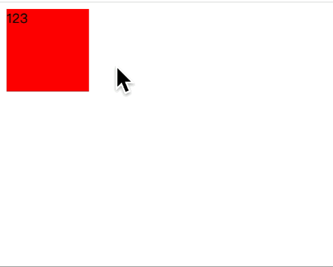

# css

## css 盒子模型

css 盒子模型是 css 布局的基础。每个盒子由四个部分组成：内容（content）、内边距（padding）、边框（border）、外边距（margin）。

css 盒子模型分为两种：

- 标准盒子模型：在标准盒子模型当中，盒子的宽度和高度是指内容 content 的宽高，不包括内边距、边框。因此设置内边距和边框，会把盒子撑大。

- 怪异盒子模型（IE 盒子模型）：在怪异盒子模型当中，盒子的宽高包括了内边距和边框。因此设置内边距和边框，不会把盒子撑大。

可以通过设置 `box-sizing` 属性来改变盒子模型。

- `content-box`：标准盒子模型，默认值。

- `border-box`：怪异盒子模型。

## css 百分比

css 不同属性的百分比值，参照的基准不一样。

1. 参照**父元素宽度**：padding、margin、width、text-indent。

2. 参照**父元素高度**：height。

3. 参照**父元素相同属性**：font-size、line-height。

4. 相对定位的元素，top、bottom 参照的是父元素 **内容（content）** 的高度，left、right 参照的是父元素内容的宽度。

5. 绝对定位的元素，参照的分别是**最近的定位元素包含 padding 的高度和宽度**。绝对定位的元素以最近的设置了定位的元素为参照元素，只要 position 不是 static 就算是设置了定位，因为 static 是默认值。

## css 定位

### 静态定位 static

默认定位，相当于没有定位。

### 相对定位 relative

- 相对于元素原本的位置进行偏移
- 元素会浮起来，脱离标准流，但仍然占据原本的位置

### 绝对定位 absolute

- 相对于最近的具有定位属性的父元素进行偏移，若没有，则相对于 `body` 进行偏移
- 元素脱离标准流，且不占据原本的位置
- 通常是“子绝父相”

### 固定定位 fixed

- 相对于浏览器窗口进行偏移
- 不会随着浏览器窗口的滚动而滚动
- 可用于创建固定头部、底部

```css
// 创建全屏遮罩
.mask {
  position: fixed;
  top: 0;
  left: 0;
  right: 0;
  bottom: 0;
  background: rgba(0, 0, 0, 0.25);
}
```

#### 相关链接

[CSS 的几种定位详解](https://blog.csdn.net/weixin_38055381/article/details/81558288)

## transform

### 平移(translate)

- translate 的平移不会影响其他元素的位置，有点类似 relative 定位。

- 百分比是相对于元素自身的**包含 padding 的宽高**。

- translate 对行内标签没有效果。

| 选项               | 说明                        |
| ------------------ | --------------------------- |
| translate(x,y)     | 同时向 x 轴和 y 轴平移      |
| translateX(x)      | 向 x 轴平移                 |
| translateY(y)      | 向 y 轴平移                 |
| translateZ(z)      | 向 z 轴平移                 |
| translate3d(x,y,z) | 同时向 x 轴、y 轴、z 轴平移 |

一种实现水平垂直居中的方法：定位+平移。

```css
.father {
  position: relative;
  width: 100px;
  height: 100px;
  background: red;
}

.son {
  position: absolute;
  top: 50%; /* 相对于父元素 */
  left: 50%; /* 相对于父元素 */
  transform: translate(-50%, -50%); /* 相对于自身宽高 */
  width: 50px;
  height: 50px;
  background: blue;
}
```

### 旋转(rotate)

- 度数单位是 deg，旋转非零的角度都需要加上单位。

- 正数-顺时针，负数-逆时针。

- 默认旋转中心是元素的中心点。

- `transform-origin` 设置旋转的中心点。默认中心点是 `50% 50%`。可以设置像素 px 或方位名词 top、bottom、left、right、center。

- `transform-origin` 以元素自身为基准，起点是元素的左上角。

- 如果是 3D 还有个 z 轴，`transform-origin: 50% 50% 0`。

| 选项                | 说明                         |
| ------------------- | ---------------------------- |
| rotate(deg)         | 旋转 deg 度                  |
| rotateX(deg)        | 绕 x 轴旋转 deg 度           |
| rotateY(deg)        | 绕 y 轴旋转 deg 度           |
| rotateZ(deg)        | 绕 z 轴旋转 deg 度           |
| rotate3d(x,y,z,deg) | 绕 x、y、z 轴同时旋转 deg 度 |

```css
transform: rotate(45deg);

/* 假设元素宽高都是20px，下面三个写法的旋转中心点相同 */
transform-origin: 50% 50%;
transform-origin: 10px 10px;
transform-origin: center center;
```

### 缩放(scale)

可以设置不同的中心点(`transform-origin`)进行缩放，默认元素中心点进行缩放，不影响其它盒子。

| 选项                | 说明                         |
| ------------------- | ---------------------------- |
| scale(x,y) | 2D 缩放                 |
| scale3d(x,y,z) | 3D 缩放           |
| scaleX(x) | x 轴缩放           |
| scaleY(y) | y 轴缩放          |
| scaleZ(z) | z 轴缩放 |

### 倾斜(skew)

2D 倾斜，在 2D 里做 3D 透视图。

|选项|说明|
|--|--|
|skew(x,y)|x 轴倾斜 x 度，y 轴倾斜 y 度|
|skewX(x)|x 轴倾斜 x 度|
|skewY(y)|y 轴倾斜 y 度|

### 综合写法

- 顺序会影响转换的效果，比如旋转会改变坐标轴的方向。

- 一般把平移放在最前面。

```css
.son {
  transform: translate(100px, 100px) rotate(45deg) scale(2, 2);
}
```

### matrix

css 矩阵，涵盖了上述所有属性。

`transform: matrix(scaleX, skewY, skewX, scaleY, translateX, translateY)`：matrix 的六个值分别代表缩放 x 轴、倾斜 y 轴、倾斜 x 轴、缩放 y 轴、平移 x 轴、平移 y 轴。

```css
.son {
  transform: matrix(1, 0, 0, 1, 0, 0);
}
```

## transition

### 简介

transition 翻译过来就是「过渡」，是指元素的某个属性（如 background-color）从某个值（如 red）变到另一个值（如 green）的过程，这是一个状态的改变。

这个状态的改变需要有某一个条件来触发，比如常见的 `:hover`、`:focus` 等。

### 例子

```html
<!DOCTYPE html>
<html lang="en">
<head>
  <meta charset="UTF-8">
  <meta name="viewport" content="width=device-width, initial-scale=1.0">
  <title>Document</title>
  <style>
    .father {
      width: 100px;
      height: 100px;
      background-color: red;
      /* transition 可以设置多个属性的过渡 */
      transition: transform ease-in 1s, background-color ease-in 1s;
    }
    .father:hover {
      transform: translate(100px, 100px) rotate(180deg) scale(2);
      background-color: green;
    }
  </style>
</head>
<body>
  <div class="father">123</div>
</body>
</html>
```



当鼠标移入元素时，元素的 transform 和 background-color 属性发生变化，此时就会触发 transition，产生动画。鼠标移出时，属性也发生变化，也会触发 transition 产生动画。

因此 transition 产生动画的条件是其设置的 css 属性发生变化，而这种变化需要事件触发。

### 用法

复合语法：`transition: property duration timing-function delay;`

|属性|说明|
|--|--|
|transition-property|过渡的属性|
|transition-duration|过渡的持续时间|
|transition-timing-function|过渡的动画函数|
|transition-delay|过渡的延迟时间，比如延迟 1s 才开始过渡|

`transition-timing-function` 的值包括以下几种：

- ease：默认值，动画效果由慢到快到慢。

- linear：匀速变化。

- ease-in：慢速开始，逐渐变快。

- ease-out：快速开始，逐渐变慢。

- ease-in-out：慢速开始和结束，中间部分加速。结合了 ease-in 和 ease-out 特点。

### 不足

- 需要事件触发，无法在网页加载时自动发生。

- 一次性的，不能重复发生，除非重复触发事件。

- 只能定义开始和结束状态，不能定义中间的状态。