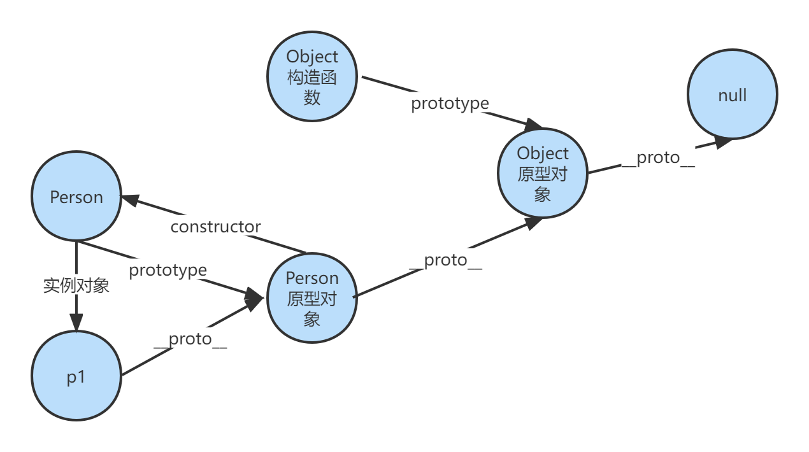

# JavaScript

## JS 有哪些数据类型

7 大基本数据类型：`Number、String、Boolean、Null、Undefined、Symbol、BigInt`。

引用数据类型：`Object`。

`Array、Date、RegExp、Map、Set` 等本质上都属于 `Object`，`typeof` 出来的结果都是 `object`。

:::tip 拓展
1、`BigInt` 是否为基本数据类型存在争议。有一种说法是，`BigInt` 不是 JS 的基本数据类型，它是 ES10 新增的数据类型，表示任意大的整数，本质上还是属于 `Number`的数据类型。

2、基本数据类型使用的是栈内存，引用数据类型使用的是堆内存。

3、基本数据类型大小固定、所占内存空间小，因此在栈中存储。

4、引用数据类型大小不固定、所占内存空间较大，若在栈中存储，会影响程序的运行性能，因此在堆中存储。同时，引用数据类型在栈中存储的是指针，指向堆中实体的起始地址。
:::

## 怎么判断 JS 数据类型

### `typeof` 判断

```js
// 7大基本数据类型
typeof 123 // number
typeof 'abc' // string
typeof true // boolean
typeof undefined // undefined
typeof null // object
typeof Symbol() // symbol
typeof BigInt(123) // bigint

// 引用数据类型
typeof {} // object
typeof [] // object
typeof new Date() // object
typeof /abc/ // object
typeof new Map() // object
typeof new Set() // object
typeof function () {} // function，特殊情况
```

### `instanceof` 判断

`instanceof` 通过判断构造函数的 `prototype` 原型对象，是否在实例对象的原型链上，来判断实例对象的数据类型。

该方法可以正确判断引用数据类型，但不能判断基本数据类型。

```js
666 instanceof Number // false
'str' instanceof String // false
true instanceof Boolean // false
Symbol(123) instanceof Symbol // false
BigInt(123) instanceof BigInt // false

[] instanceof Array // true
{} instanceof Object // true
function () {} instanceof Function // true
new Date() instanceof Date // true
/abc/ instanceof RegExp // true
new Map() instanceof Map // true
new Set() instanceof Set // true
```

### `constructor` 判断

`constructor` 属性返回实例对象的构造函数，可以用来判断基本数据类型。

```js
var a

// 基本数据类型
a = 123
a.constructor === Number // true
a = 'abc'
a.constructor === String // true
a = true
a.constructor === Boolean // true
Symbol(123).constructor === Symbol // true`
BigInt(123).constructor === BigInt // true

// 引用数据类型
a = []
a.constructor === Array // true
a = {}
a.constructor === Object // true
a = function () {}
a.constructor === Function // true
a = new Date()
a.constructor === Date // true
a = /abc/
a.constructor === RegExp // true
```

### `Object.prototype.toString.call` 判断

`Object.prototype.toString.call` 方法用于将一个对象转换为字符串，返回一个字符串。

```js
Object.prototype.toString.call(123) // [object Number]
Object.prototype.toString.call('abc') // [object String]
Object.prototype.toString.call(true) // [object Boolean]
Object.prototype.toString.call(undefined) // [object Undefined]
Object.prototype.toString.call(null) // [object Null]
Object.prototype.toString.call(Symbol(123)) // [object Symbol]
Object.prototype.toString.call(BigInt(123)) // [object BigInt]
Object.prototype.toString.call({}) // [object Object]
Object.prototype.toString.call([]) // [object Array]
Object.prototype.toString.call(function () {}) // [object Function]
```

:::tip 为何不直接使用 obj.toString 的形式判断？
`toString()` 是 `Object` 原型的方法，其功能是返回对象的具体类型。

但 `Array, Function` 等构造函数的原型都重写了 `toString` 方法，因此实例对象直接调用 `toString` 使用的是重写后的方法，而非 `Object` 原型上的 `toString`。

```js
arr = [1, 2, 'hello']
arr.toString() // '1,2,hello'

func = function () {
  console.log('hello')
}
func.toString() // 'function () { console.log('hello') }'

a = 123
a.toString() // '123'
a = true
a.toString() // 'true'
```

:::

## 基本数据类型为何能调用方法？

基本数据类型都有其对应的包装类，能够调用方法是因为进行了自动封装。

## `null` 和 `undefined` 的区别

相同点：

`undefined` 和 `null` 都是基本数据类型，都只有一个值，`undefined` 和 `null`。

不同点：

- `undefined` 代表未定义，使用 `var` 定义变量但没赋值就是 `undefined`，函数没有返回值则返回的也是 `undefined`。`null` 代表空对象，一般用于初始化可能为对象的变量。

- `undefined` 可以放在赋值语句的左边，`null` 不可以。可以通过 `void 0` 安全地获得 `undefined`。

```js
undefined = 3; // 不报错
null = 3; // Uncaught SyntaxError: Invalid left-hand side in assignment

void 0 === undefined; // true
```

- `typeof undefined` 返回 `undefined`。`typeof null` 返回 `object`，这是个历史遗留问题。

- `undefined == null` 返回 true，`undefined === null` 返回 false。

## `new` 一个构造函数发生什么事

1. 创建一个空对象。

2. 将这个空对象的 `__proto__` 属性指向构造函数的原型对象 `prototype`。

3. 将构造函数的 `this` 指向这个新对象，并执行构造函数的代码。

4. 如果构造函数有返回值，则返回该值。如果没有，则返回这个创建的新对象。

一个标准的 `new` 过程效果如下。

```js
function Person(name) {
  this.name = name
}
Person.prototype.sayHello = function () {
  console.log('hello, my name is ' + this.name)
}

const person = new Person('kimmy')

person.name // kimmy
person.sayHello() // hello, my name is kimmy
```

手动实现一个 `new` 运算。

```js
function myNew() {
  // 创建空对象
  const obj = {}
  // 获取构造函数，约定第一个参数是构造函数
  const constructorFunc = Array.prototype.shift.call(arguments)
  // 空对象的__proto__指向构造函数的prototype
  obj.__proto__ = constructorFunc.prototype
  // 构造函数的this指向空对象，并执行构造函数
  const result = constructorFunc.apply(obj, arguments)
  // 如果构造函数有返回值，则返回该值，否则返回空对象
  return typeof result === 'object' ? result : obj
}

const myPerson = myNew(Person, 'kimmy')
person.name // kimmy
person.sayHello() // hello, my name is kimmy
```

## 如何理解原型链？

:::tip 回答思路
首先说什么是原型，为什么设计原型（共享属性和方法），再说属性和方法的查找顺序，自然而然谈到了原型链。原型链可以隐身到继承，继承结合构造函数和原型。
:::

1、为什么设计原型

当我们使用 new 构造函数的方式创建实例时，定义在构造函数内部的方法会在每个实例里都创建一遍，这样一来就造成了内存空间的浪费，因为这些方法的功能都是相同的，没有必要多次创建。

因此原型就被设计出来解决这个问题，每个构造函数都有一个原型对象 prototype，在原型里定义的方法和属性可以被所有的实例对象共享。因此，通过将方法定义在原型对象 prototype 上，就能避免方法的重复创建。

2、原型链是什么

每个实例对象都有一个 `__proto__` 属性，指向它的构造函数的原型对象 prototype，而原型对象 prototype 它本身也是一个对象，它也有 `__proto__` 属性，指向它自己的构造函数的原型对象，这样一层一层往上走，就形成了原型链。原型链的终点是 Object 构造函数的原型对象，它的 `__proto__` 属性指向 null。

3、属性和方法的查找顺序

原型链实际上提供了一条查询属性和方法的路径，当我们要访问一个对象的属性时，首先看这个对象本身是否存在这个属性，如果没有，再沿着原型链查找原型对象，一直到原型链的终点为止。

