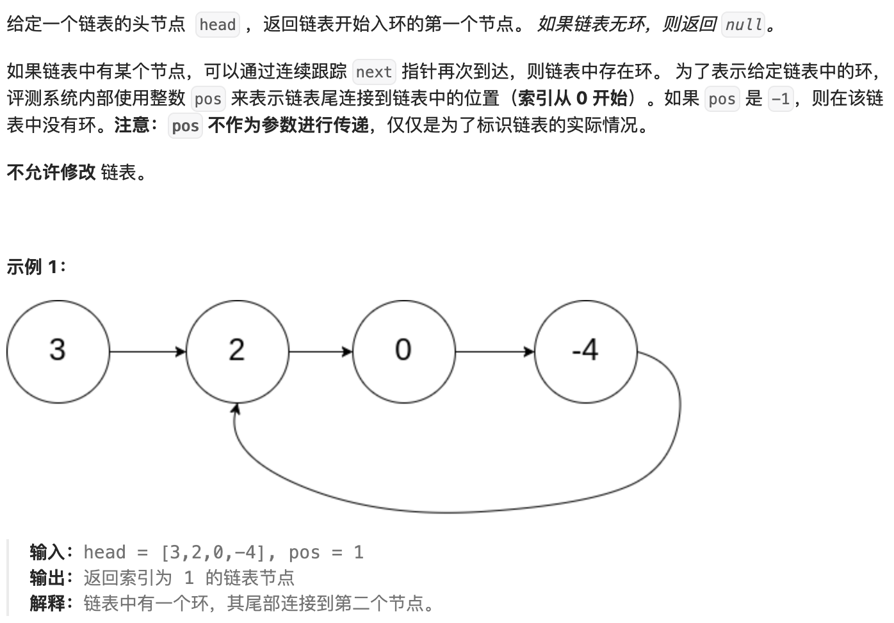
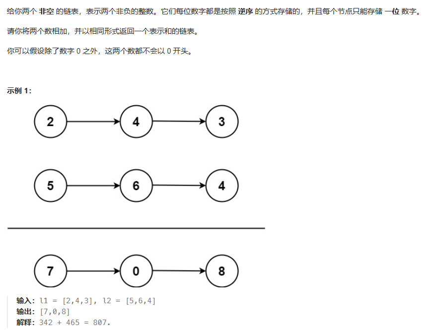
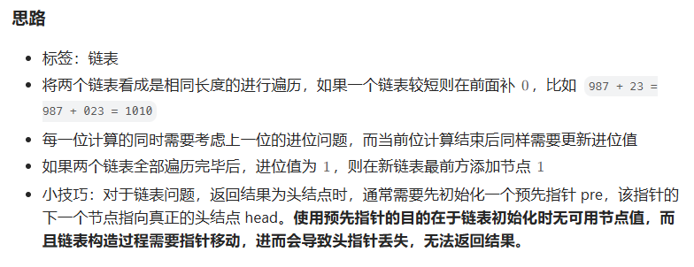
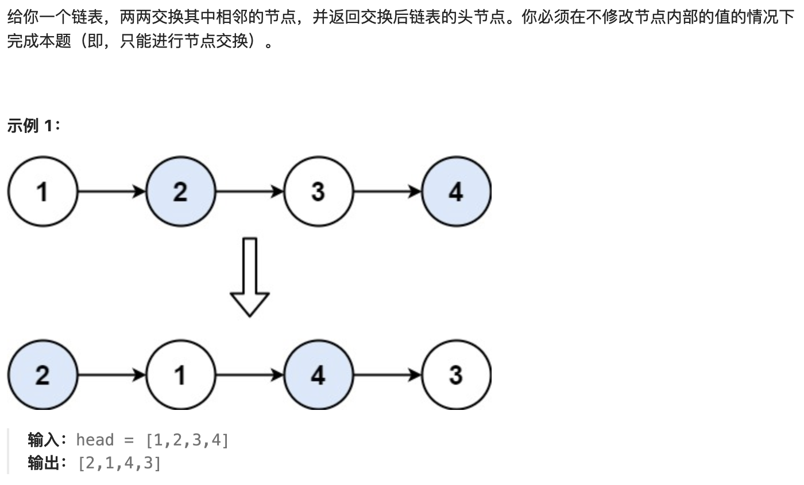
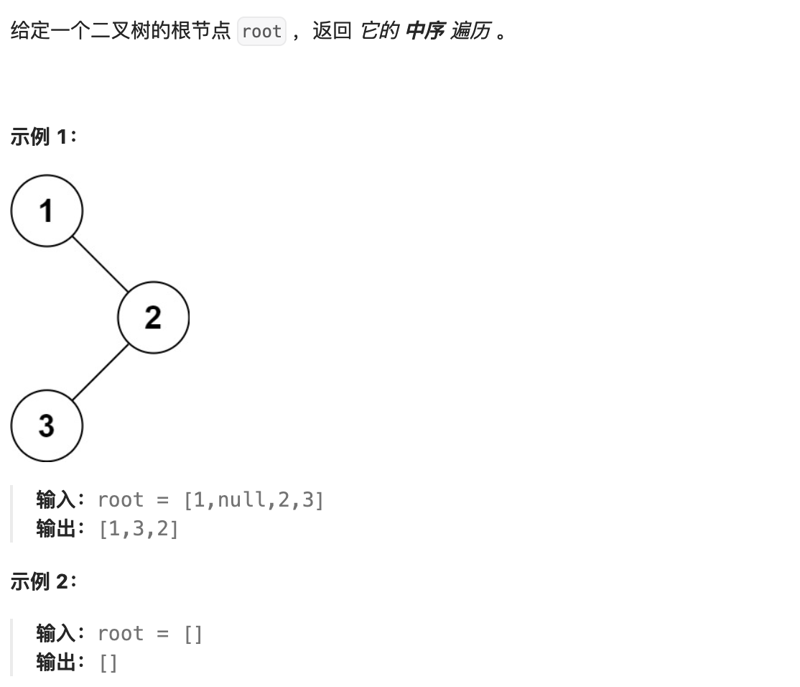
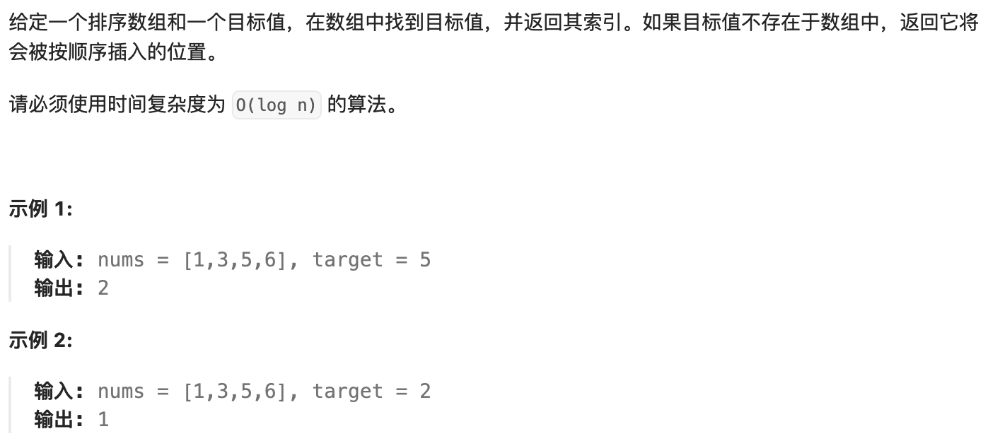

# LeetCode Top 100

## 哈希

### 1. [两数之和](https://leetcode.cn/problems/two-sum/description/)

题目：

给定一个整数数组 nums 和一个整数目标值 target，请你在该数组中找出 和为目标值 target 的那 两个 整数，并返回它们的数组下标。

你可以假设每种输入只会对应一个答案。但是，数组中同一个元素在答案里不能重复出现。

你可以按任意顺序返回答案。

```
输入：nums = [2,7,11,15], target = 9
输出：[0,1]
解释：因为 nums[0] + nums[1] == 9 ，返回 [0, 1] 。
```

代码：

```js
/**
 * @param {number[]} nums
 * @param {number} target
 * @return {number[]}
 */
var twoSum = function (nums, target) {
  const map = new Map()
  for (let i = 0; i < nums.length; i++) {
    const gap = target - nums[i]
    if (map.has(nums[i])) {
      return [map.get(nums[i]), i]
    }
    map.set(gap, i)
  }
  return []
}
```

## 双指针

## 滑动窗口

## 子串

## 普通数组

## 矩阵

## 链表

### 160. [相交链表](https://leetcode.cn/problems/intersection-of-two-linked-lists/description/)

标签：双指针、哈希表

题目：


代码：

```js
var getIntersectionNode = function (headA, headB) {
  if (headA === null || headB === null) {
    return null
  }
  var a = headA,
    b = headB
  while (a !== b) {
    a = a ? a.next : headB
    b = b ? b.next : headA
  }
  return a
}
```

### 206. [反转链表](https://leetcode.cn/problems/reverse-linked-list/description/)

题目：


标签：双指针、递归

代码：

```js
var reverseList = function (head) {
  var pre = null,
    cur = head
  while (cur) {
    var tmp = cur.next
    cur.next = pre
    pre = cur
    cur = tmp
  }
  return pre
}
```

### 234. [回文链表](https://leetcode.cn/problems/palindrome-linked-list/description/)

标签：栈、递归

题目：


代码：

```js
// 方法一：先用数组记录下链表所有元素，再用双指针判断是否回文
var isPalindrome = function (head) {
  var arr = [],
    p = head
  while (p) {
    arr.push(p.val)
    p = p.next
  }
  for (var i = 0, j = arr.length - 1; i < j; i++, j--) {
    if (arr[i] !== arr[j]) {
      return false
    }
  }
  return true
}

// 方法二：栈存储，再遍历比较弹出
var isPalindrome = function (head) {
  var stack = [],
    p = head
  while (p) {
    stack.push(p.val)
    p = p.next
  }
  while (head) {
    if (head.val !== stack.pop()) {
      return false
    }
    head = head.next
  }
  return true
}

// 方法二优化：相当于只需要比较链表前半部分和后半部分即可
var isPalindrome = function (head) {
  var stack = [],
    p = head
  var len = 0
  while (p) {
    stack.push(p.val)
    p = p.next
    len++
  }
  len = len / 2
  while (len-- >= 0) {
    if (head.val !== stack.pop()) {
      return false
    }
    head = head.next
  }
  return true
}

// 方法三：递归，难理解
var p = null

var isPalindrome = function (head) {
  p = head
  return check(head)
}

var check = function (head) {
  if (!head) {
    return true
  }
  var res = check(head.next) && p.val === head.val
  p = p.next
  return res
}

// 帮助理解方法三：逆序打印链表
var printList = function (head) {
  if (!head) {
    return
  }
  printList(head.next)
  console.log(head.val)
}
```

### 141. [环形链表](https://leetcode.cn/problems/linked-list-cycle/description/)

标签：双指针、哈希表

题目：

给你一个链表的头节点 head ，判断链表中是否有环。

如果链表中有某个节点，可以通过连续跟踪 next 指针再次到达，则链表中存在环。为了表示给定链表中的环，评测系统内部使用整数 pos 来表示链表尾连接到链表中的位置（索引从 0 开始）。注意：pos 不作为参数进行传递。仅仅是为了标识链表的实际情况。

如果链表中存在环，则返回 true。 否则，返回 false。


代码：

```js
// 双指针：快慢指针
var hasCycle = function (head) {
  var slow = head,
    fast = head
  while (fast && fast.next) {
    slow = slow.next
    fast = fast.next.next
    if (slow === fast) {
      return true
    }
  }
  return false
}
```

### 142. [环形链表 II](https://leetcode.cn/problems/linked-list-cycle-ii/description/)

标签：哈希表、双指针、快慢指针

题目：



代码：

```js
// 方法一：遍历链表，哈希表存储每个节点的地址，若哈希表里有重复的地址，则返回该地址，即为环的入口
var detectCycle = function (head) {
  var map = new Map();
  var p = head;
  while(p) {
    if (map.has(p)) {
      return p;
    }
    map.set(p);
    p = p.next;
  }
  return p;
}

// 方法二：快慢双指针。
// 首先快慢指针找到第一次重合的节点，接着快指针从头开始，两个指针相遇的节点即为环的入口
var detectCycle = function(head) {
  var slow = head, fast = head;
  while(true) {
    // 没有环，返回null
    if (!fast || !fast.next) {
      return null;
    }
    slow = slow.next;
    fast = fast.next.next;
    // 找到重合的第一个节点
    if (slow === fast) {
      break;
    }
  }

  // 快指针返回头节点
  fast = head;
  while(slow !== fast) {
    slow = slow.next;
    fast = fast.next;
  }
  return slow;
}
```

### 21. [合并两个有序链表](https://leetcode.cn/problems/merge-two-sorted-lists/description/)

标签：递归、双指针

题目：


代码：

```js
// 方法一：遍历链表存到数组，排好序，返回一个新链表
var mergeTwoLists = function (l1, l2) {
  if (!l1 && !l2) {
    return null
  }
  var arr = []
  while (l1) {
    arr.push(l1.val)
    l1 = l1.next
  }
  while (l2) {
    arr.push(l2.val)
    l2 = l2.next
  }
  arr.sort((a, b) => a - b)
  var head = new ListNode(),
    p = head
  for (var i = 0; i < arr.length; i++) {
    p.val = arr[i]
    if (i < arr.length - 1) {
      p.next = new ListNode()
      p = p.next
    }
  }
  return head
}

// 方法二：快慢链表
var mergeTwoLists = function (l1, l2) {
  var head = new ListNode(),
    p = head
  while (l1 && l2) {
    if (l1.val <= l2.val) {
      p.next = l1
      l1 = l1.next
    } else {
      p.next = l2
      l2 = l2.next
    }
    p = p.next
  }
  p.next = l1 || l2
  return head.next
}
```

### 2. [两数相加](https://leetcode.cn/problems/add-two-numbers/description/)

标签：链表、pre 指针

题目：





代码：

```js
var addTwoNumbers = function (l1, l2) {
  var pre = new ListNode(0)
  var cur = pre

  // 进位
  var carry = 0
  while (l1 || l2) {
    var a = l1 ? l1.val : 0
    var b = l2 ? l2.val : 0
    // 求和
    var sum = a + b + carry
    // 注意此处要向下取整，计算进位
    carry = Math.floor(sum / 10)
    // 取余数
    sum = sum % 10

    cur.next = new ListNode(sum)
    cur = cur.next
    if (l1) {
      l1 = l1.next
    }
    if (l2) {
      l2 = l2.next
    }
  }
  if (carry > 0) {
    cur.next = new ListNode(carry)
  }
  return pre.next
}
```

### 19. [删除链表的倒数第 N 个结点](https://leetcode.cn/problems/remove-nth-node-from-end-of-list/description/)

标签：pre 指针、双指针

题目：


代码：

```js
// 思路：快指针先移动 n 步，接着两个指针共同移动，直到快指针到尾部，此时慢指针刚到到达被删除节点的前一个节点
var removeNthFromEnd = function(head, n) {
  // 技巧：好用的 pre 指针
  var pre = new ListNode();
  pre.next = head;
  // 初始化快慢指针为 pre 指针
  var slow = pre, fast = pre;
  // fast 先移动 n 步
  while(n > 0) {
    fast = fast.next;
    n -= 1;
  }
  // 快慢指针一起向前移动，直到快指针到末尾
  while(fast.next) {
    slow = slow.next;
    fast = fast.next;
  }
  // 删除节点
  slow.next = slow.next.next;
  // 返回 pre.next，head 可能被删除
  return pre.next;
}
```

### 24. [两两交换链表中的节点](https://leetcode.cn/problems/swap-nodes-in-pairs/description/)

标签：递归、迭代、pre 指针

题目：



代码：

```js
// 方法一：递归
var swapPairs = function (head) {
  // 终止条件：当前无节点或只有一个节点，无法交换
  if (!head || !head.next) {
    return head;
  }

  // 递归调用单元：head 连接后面完成交换的子链表，next 连接 head，完成交换
  var temp = head.next;
  head.next = swapPairs(temp.next);
  temp.next = head;

  // 返回值：完成交换的子链表
  return temp;
}

// 方法二：迭代
var swapPairs = function (head) {
  var pre = new ListNode();
  pre.next = head;
  var p = pre;
  while (p.next && p.next.next) {
    var start = p.next;
    var end = p.next.next;
    start.next = end.next;
    end.next = start;
    p.next = end;
    p = start;
  }
  return pre.next;
}
```

## 二叉树

### 94.[二叉树的中序遍历](https://leetcode.cn/problems/binary-tree-inorder-traversal/description/)

标签：深度优先搜索、递归

题目：



代码：

```js
var inorderTraversal = function (root) {
  var res = [];
  inorder(root, res);
  return res;
}

var inorder = function (root, res) {
  if (!root) {
    return;
  }
  inorder(root.left, res);
  res.push(root.val);
  inorder(root.right, res);
}
```

## 图论

## 回溯

## 二分查找

### 35.[搜索插入位置](https://leetcode.cn/problems/search-insert-position/description/)

标签：二分查找

题目：



代码：

```js
var searchInsert = function (nums, target) {
  var len = nums.length;
  if (nums[len - 1] < target) {
    return len;
  }
  var left = 0, right = len - 1;
  while (left < right) {
    // 除以 2 向下取整
    var mid = (left + right) >> 1;
    if (nums[mid] === target) {
      return mid;
    } else if (nums[mid] < target) {
      // 注意 left 要加 1，不然向下取整可能会导致死循环
      left = mid + 1;
    } else {
      right = mid;
    }
  }
  return left;
}
```

## 栈

## 堆

## 贪心算法

## 动态规划

## 多维动态规划

## 技巧
