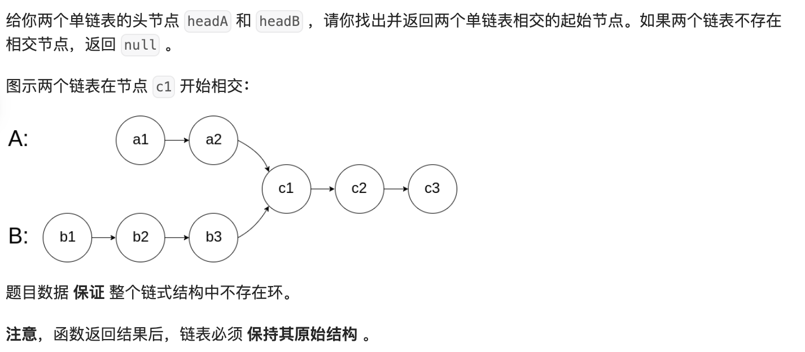
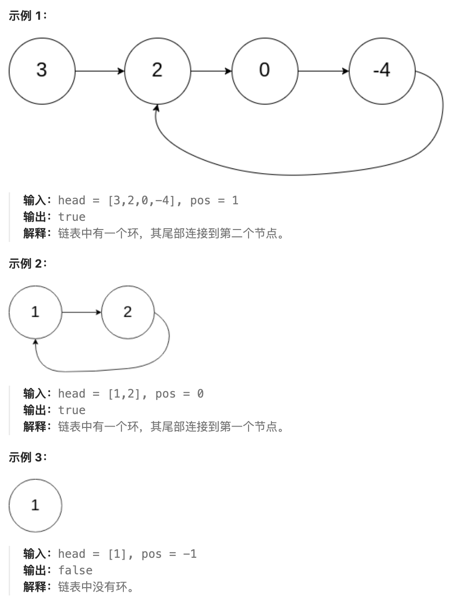

# LeetCode Top 100

## 哈希

### 1. [两数之和](https://leetcode.cn/problems/two-sum/description/)

题目：

给定一个整数数组 nums 和一个整数目标值 target，请你在该数组中找出 和为目标值 target  的那 两个 整数，并返回它们的数组下标。

你可以假设每种输入只会对应一个答案。但是，数组中同一个元素在答案里不能重复出现。

你可以按任意顺序返回答案。

```
输入：nums = [2,7,11,15], target = 9
输出：[0,1]
解释：因为 nums[0] + nums[1] == 9 ，返回 [0, 1] 。
```

代码：

```js
/**
 * @param {number[]} nums
 * @param {number} target
 * @return {number[]}
 */
var twoSum = function(nums, target) {
  const map = new Map();
  for (let i = 0;i < nums.length;i++) {
    const gap = target - nums[i];
    if (map.has(nums[i])) {
      return [map.get(nums[i]), i];
    }
    map.set(gap, i);
  }
  return [];
};
```

## 双指针

## 滑动窗口

## 子串

## 普通数组

## 矩阵

## 链表

### 160. [相交链表](https://leetcode.cn/problems/intersection-of-two-linked-lists/description/)

标签：双指针、哈希表

题目：



代码：

```js
var getIntersectionNode = function(headA, headB) {
  if (headA === null || headB === null) {
    return null;
  }
  var a = headA, b = headB;
  while (a !== b) {
    a = a ? a.next : headB;
    b = b ? b.next : headA;
  }
  return a;
}
```

### 206. [反转链表](https://leetcode.cn/problems/reverse-linked-list/description/)

题目：


标签：双指针、递归

代码：

```js
var reverseList = function(head) {
  var pre = null, cur = head;
  while (cur) {
    var tmp = cur.next;
    cur.next = pre;
    pre = cur;
    cur = tmp;
  }
  return pre;
}
```

### 141. [环形链表](https://leetcode.cn/problems/linked-list-cycle/description/)

标签：双指针、哈希表

题目：

给你一个链表的头节点 head ，判断链表中是否有环。

如果链表中有某个节点，可以通过连续跟踪 next 指针再次到达，则链表中存在环。为了表示给定链表中的环，评测系统内部使用整数 pos 来表示链表尾连接到链表中的位置（索引从 0 开始）。注意：pos 不作为参数进行传递。仅仅是为了标识链表的实际情况。

如果链表中存在环，则返回 true。 否则，返回 false。




代码：

```js
// 双指针：快慢指针
var hasCycle = function(head) {
  var slow = head, fast = head;
  while (fast && fast.next) {
    slow = slow.next;
    fast = fast.next.next;
    if (slow === fast) {
      return true;
    }
  }
  return false;
}
```

## 二叉数

## 图论

## 回溯

## 二分查找

## 栈

## 堆

## 贪心算法

## 动态规划

## 多维动态规划

## 技巧