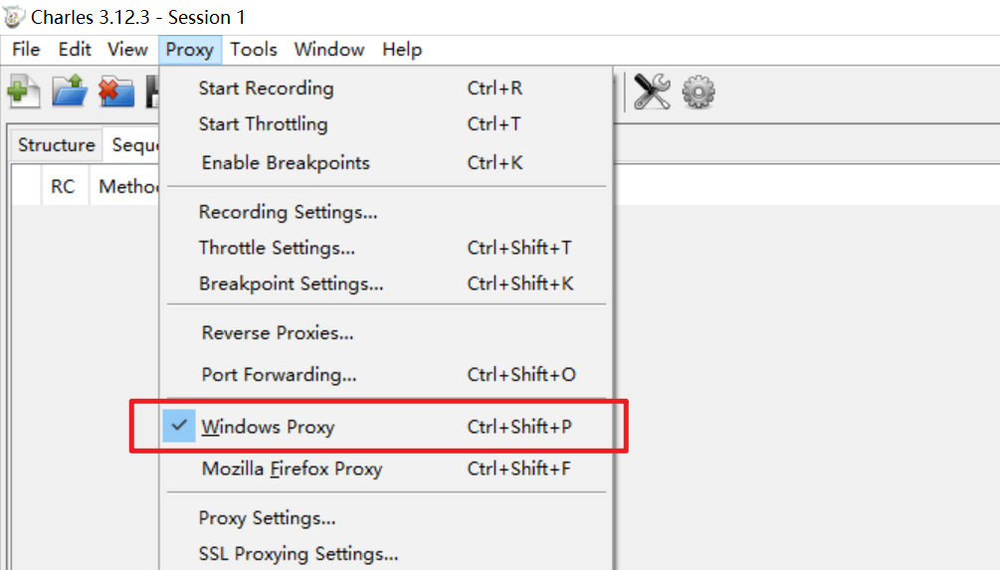
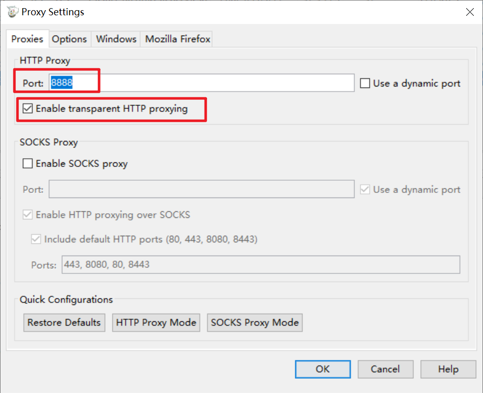
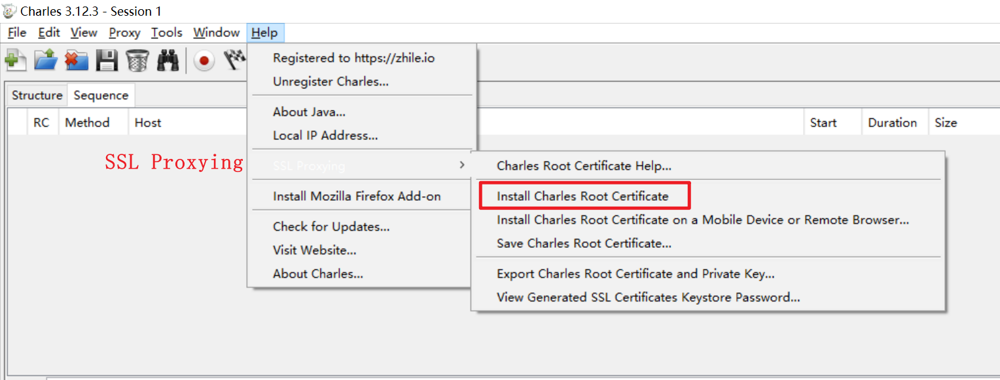
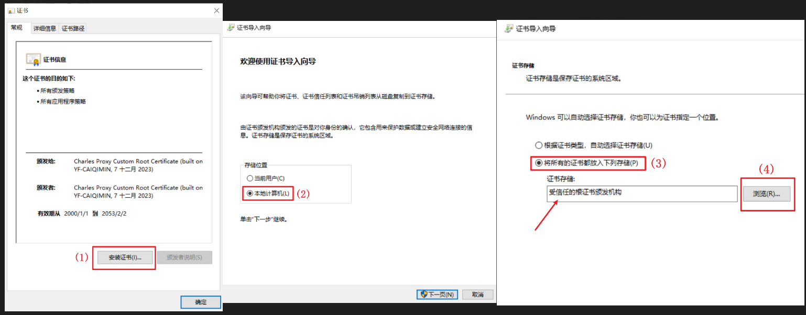

# 日常开发工具

## classnames

一个实用的工具库，方便我们根据条件动态组合类名。

安装 `classnames`。

```bash
npm install classnames
```

用法。

```jsx
import classNames from 'classnames';

class App extends React.Component {
  render() {
    return (
      <div className={classNames(
        'btn', 
        { 'btn--red': isRed },
        { 'btn--blue': isBlue}
      )}>
        Hello World!
      </div>
    );
  }
}
```

## moment

一个日期时间工具库，在 JavaScript 中解析、校验、操作和展示日期和时间。

[moment 中文网](https://momentjs.cn/){link=card}

[moment 英文网](https://momentjs.com/){link=card}

### 安装

```bash
npm install moment --save
```

### 格式化为日期时间字符串

注意 `HH:mm:ss` 和 `hh:mm:ss` 的区别，前者是24小时制，后者是12小时制。

```js
moment().format('YYYY-MM-DD HH:mm:ss'); // 2023-01-01 17:20:20
moment().format('YYYY-MM-DD hh:mm:ss'); // 2023-01-01 05:20:20
moment(new Date()).format('YYYY-MM-DD HH:mm:ss'); // 2023-01-01 17:20:20
moment(1703150359094).format('YYYY-MM-DD HH:mm:ss'); // 2023-12-21 17:19:19
```

### 计算时间差

## NVM

nvm 是管理 node 版本的快捷工具，使用它可以十分方便地切换 node 版本。

### nvm 常用命令

```bash
nvm list     // 查看已安装的 node 版本
nvm install <version>       // 安装某个版本的 node，如：nvm install 12.22.22
nvm use <version>      // 使用某一版本的 node
nvm uninstall <version>   // 卸载指定版本的 node
```

### nvm 的安装

[nvm 详细安装步骤以及使用（window10 系统）](https://blog.csdn.net/Anony_me/article/details/124153201){link=card}

## Charles

Charles 是网络代理应用软件。

:::warning 提示
以下操作均在 Windows 系统下进行。Mac 系统自行查阅资料。
:::

### 安装

从[官网](https://www.charlesproxy.com/)下载无脑安装即可。

Charles 的注册码通行证，自行搜索找吧。

### 开启系统代理

路径：`Proxy -> Windows Proxy`。




### 抓取 http 网络包

路径：`Proxy -> Proxy Settings`。

端口填 8888，`Enable transparent HTTP proxying` 勾选上。



### 抓取 https 网络包

安装上 CA 证书即可。

路径：`Help -> SSL Proxying -> Install Charles Root Certificate`。



安装步骤，如图所示。



安装好后，查看有效期是否正确即可。

### 域名重定向

域名重定向，是指将指定的网络请求重定向到另一个地址。可以避免本地运行项目时的接口跨域问题。

路径：`Tools -> Map Remote`。


这个配置的含义是，将 `test.local.com` 的请求映射到本地的 3002 端口（本地项目运行的端口），也就是访问 `test.loca.com` 其实就是访问 `127.0.0.1:3002`。

如果直接访问 `127.0.0.1:3002`，会出现跨域问题，和接口的域名不一致。

配置好的域名重定向，可以导出成 `xml` 文件，下次使用可以一键导入。
